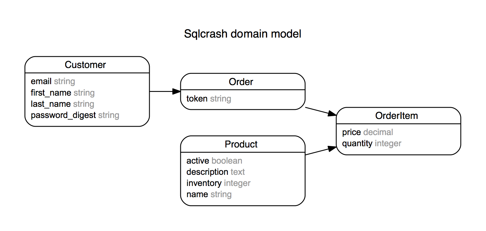

# SQL Crash Course



If you want to follow along:
---------

1. Install Postgres and get running. Easiest way is with [http://postgresapp.com/]
1. Install Postico to run SQL queries: [https://eggerapps.at/postico/]
1. Download [sqlcrash.sql]
1. Using Terminal, run the following command in the directory you saved
   sqlcrash.sql

> psql -f sqlcrash.sql

More information on http://www.postgresqltutorial.com/postgresql-restore-database/

Then, connect to Postgres using Postico.

Additional Resources
--------------------

1. http://sqlteaching.com/
1. http://www.postgresqltutorial.com/


Queries we ran in the SQL Crash Course
--------------------------------------


```
SELECT name, inventory
FROM products
where id > 15 and id < 30

INSERT INTO products 
(name, inventory, description, active, created_at, updated_at)
VALUES ('iphone', 1, 'Bendable Phone', true, '2016-06-19', '2016-06-19')

UPDATE products 
set active = false
WHERE id = 52

DELETE FROM products
where id = 52


SELECT * 
FROM orders
JOIN customers
ON customers.id = orders.customer_id
WHERE orders.id = 9;


# Orders by specific customer

SELECT * 
FROM orders
JOIN customers
ON customers.id = orders.customer_id
where customers.id = 5;


UPDATE customers
set first_name = 'brisa', last_name = 'hermann'
where id = 5;


# Email list of customers who have placed an order

select email, count(*) from customers

JOIN orders on orders.customer_id = customers.id
GROUP BY customers.email
;


# Top 3 customers by order items price
select email, sum(order_items.price) from customers

JOIN orders on orders.customer_id = customers.id
JOIN order_items on order_items.order_id = orders.id
GROUP BY customers.email
ORDER BY sum(order_items.price) DESC
LIMIT 3
;

#  searching in a string
select * 
from products
where 
name ILIKE '%Car%' 

# Multiple conditions with AND/OR AND searching in a string

select * 
from products
where 
(
  name ILIKE '%Car%' 
    OR description ILIKE '%GB%'
    )
AND active = true

```
